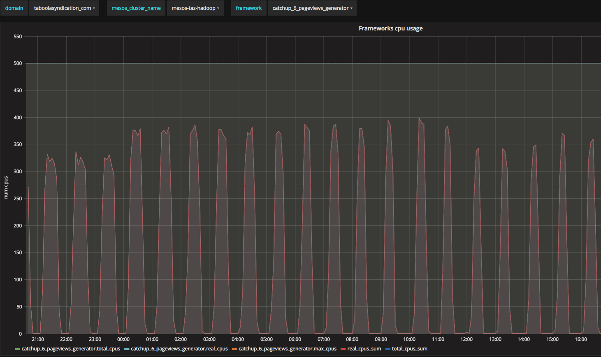
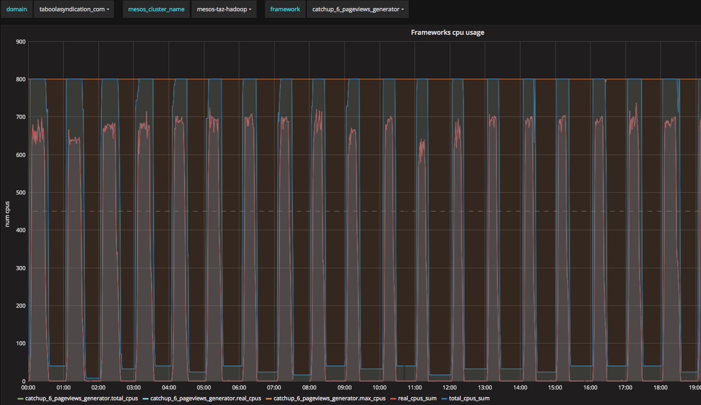

This is draft version, subject to changes and pollishing
# Using Spark Dynamic Allocation on Mesos

## Environment
1. Spark v2.2.0
1. Mesos v1.1.0
1. Number of cores: thousands
1. Number of Mesos-slave nodes: hundreds

### Terms
* In Mesos cluster environment "framework" and "application" are same

The story starts from metrics. You need to have some metric system that will show you that you are underutilizing your available resources. 
In Taboola, we are using Graphana, Metrictank with Kafka based pipeline to collect metrics from several DCs around the world.

In addition, we have long running services that once in a while, upon some external trigger start to process new chunks of data. However, in between the resources are not used, but no other framework can use them due to static allocation. 



One can notice, that the total number of cores taken from the Mesos cluster(total_cpus_sum) is contant and stands on 500 cores, while real usage of cpus across all Mesos-slave nodes, which executing tasks of the framework(aka application) stands on 400 cores at peacks, however, more importantly, there are idle times with 0 cpus usage.

At this moment we can define our goal as:
1. Utilize better available resources
1. Improve end-to-end processing time

One way to release unused resources in the static cluster(we are running on-premise, with static number of Mesos-slave nodes) is to start using [dynamic allocation](https://spark.apache.org/docs/latest/job-scheduling.html#configuration-and-setup) feature. In dynamic cluster setups(e.g. when using spot-instances in AWS) this solution might be not relevant.

## What is dynamic allocation?
* Spark provides a mechanism to dynamically adjust the resources your application occupies based on the workload
* Your application may give resources back to the cluster if they are no longer used and request them again later when there is demand
* Particularly useful if multiple applications share resources in your Spark cluster

Since we've seen clear idle times, we have several frameworks sharing resources of the same cluster, it seemed like perfect use-case for dynamic allocation. We've started to explore how to apply this feature and found out that there are not so many reports available. Hopefully, you'll find some valuable details in this report. The documentation on spark site is pretty limited. Moreover there is no discussion how it should be applied specifically on Mesos cluster environment. [Spark user list](http://apache-spark-user-list.1001560.n3.nabble.com/) lacks this information as well.

At basic level this is what happening: Spark driver monitors number of pending tasks. When there is no such or number of executors suffies, timeout timer is installed. If it expires, the driver turns off executors of the application on Mesos-slave nodes. The only problem with this approach is that killed executors might have produced shuffle files that might be in need by other still-alive executors. To solve this issue, we need external shuffle service that will serve aforementioned shuffle files as a proxy of dead executor.


## Basic prerequisites
1. External Shuffle Service 
   1. Must run on every spark node
        * Spark executor will connect to localhost:shuffle-service-port
        * Spark executor will register itself and every shuffle files it produces
        * External shuffle service will remain alive after executor is dead and will serve shuffle files to other executors
   1. spark.shuffle.service.enabled = true
1. Dynamic Allocation feature flag
   1. spark.dynamicAllocation.enabled = true


## How to make sure external shuffle service is running on every mesos-slave node? 
Spark documentation mentions Marathon as one way to achieve this.

Another KISS approach is to install on every mesos-slave machine this service side by side with mesos-slave agent service and manage it with your favorite configuration tool. However, it will couple you to a specific spark version and you'll loose abstraction that Mesos cluster provides you(e.g. running multiple spark versions on the same cluster). 

More natural approach is to use [Marathon](https://mesosphere.github.io/marathon/). Marathon is meta-framework that manages other frameworks. You can think about it as "init.d" for Mesos cluster frameworks. It has many usecases, however we want ability to run cross-cluster services in HA mode(if some Mesos-slave node will lack external shuffle service - the mesos-slave will be useless and all spark tasks of application that uses dynamic allocation will fail).

We want that external shuffle service will run exactly 1 process(or task in marathon lingua) on every mesos-slave. This requirement has 2 faces: given some number of slaves in cluster, the Marathon, by default, won't promise that every one of them is running given service, it might place 2 processes on the same node, based on available resources on each node; in addition, there could be situations that there are no available resources to run the service on specific node(e.g. other Mesos framework/s took all available resources). For the first problem Marathon provides ability to define service [constraints](http://mesosphere.github.io/marathon/docs/constraints.html) that will make sure that no 2 tasks are running for the same service on the same node(```"constraints": [["hostname", "UNIQUE"]]```). For the second problem we've found that static reservation of resources on mesos-slaves could be in use.
   


## Mesos-slave nodes reserve resources statically for "shuffle" role
1. We decided that everything connected to external shuffle service will run under "shuffle" role
1. We will use [static reservation](http://mesos.apache.org/documentation/latest/reservation/) for the role on every mesos agent, e.g.
   * ```
      --resources=cpus:10;mem:16000;ports:[31000-32000];cpus(shuffle):2;mem(shuffle):2048;ports(shuffle):[7337-7339]
      ```
   * 31000-32000 is the default port range that mesos agent reports to mesos master
   * We are allocating 2g of RAM for external shuffle service
   * We are allocating ports 7337 to 7339 for external shuffle services(for green-blue, different spark versions etc)
   * The resources might be overprovisioned(e.g. we have 10 cpus on specific machine, but still report that all other roles has 10 cpus and additional 2 cpus specifically for the shuffle role)
   * When overprovisioning, you will see +2 cpus on every node(but usual frameworks won’t be able to use these resources
1. Start Marathon masters with specifying same role:
   * You still can use different Marathon quorum to run other frameworks with different roles
   * Use CLI flag ```--mesos_role shuffle```
1. Add alert for monitoring Marathon masters
1. Manage those with configuration service of your choice(chef/puppet/ansible etc)

At this point we've solved two problems, and made sure that no-matter what is resources utilizaiton on some mesos-slave node, the external shuffle service will get it's own resources and will run only 1 Marathon task instance on same mesos-slave.

We've started to test dynamic allocation in staging environment and found that after running for 20 or so minutes the tasks started to fail due to missed shuffle files. Seems like there are different corner cases when shuffle files are deleted preliminary.


## External Shuffle Service and Shuffle files management
1. The first rule of the external shuffle service - don’t delete shuffle files ... too soon
1. There are some traces for the problem out there, e.g. [SPARK-12583](https://issues.apache.org/jira/browse/SPARK-12583) - solves problem of removing shuffles files too early by sending heartbeats to every external shuffle service from application.
   * Driver must register to all external shuffle services running on mesos-slave nodes it have executors at
   * Despite the complete refactoring of this mechanims, it still not always working. Opened [SPARK-23286](https://issues.apache.org/jira/browse/SPARK-23286)
1. At the end (even if fixed) it's not good for our use-case of long running spark services
   * Framework “never” ends, so it's not clear when to remove shuffle files
1. We'have disabled cleanup by external shuffle service by -Dspark.shuffle.cleaner.interval=31557600
1. Installed simple cron job on every spark slave that cleans shuffle files that weren't touched more than X hours. You need pretty big disks for this to work to have some buffer.


## Marathon service descriptor management
1. Marathon supports [REST API](http://mesosphere.github.io/marathon/api-console/index.html):
   ```
   curl -v localhost:8080/v2/apps -XPOST -H "Content-Type: application/json" -d'{...}’
   ```
1. Json descriptors are commited to git repo to maintain history and are distributed to Marathon master machines
1. The Marathon leader in quorum runs periodic check for Up-to-dateness settings and updates service descriptor through REST-API if necessary
1. Here is Marathon service json descriptor for shuffle service that runs on port 7337:
   * *instances* are dynamically configured
   * Using Mesos [REST-API](http://mesos.apache.org/documentation/latest/endpoints/master/slaves/) to find out active slaves
   * Using Marathon REST-API to find out number of running tasks(instances) of the given service
```
{
  "id": "/shuffle-service-7337",
  "cmd": "spark-2.2.0-bin-hadoop2.7/sbin/start-mesos-shuffle-service.sh",
  "cpus": 0.5,
  "mem": 1024,
  "instances": 20,
  "constraints": [["hostname", "UNIQUE"]],
  "acceptedResourceRoles": ["shuffle"],
  "uris": ["http://my-repo-endpoint/spark-2.2.0-bin-hadoop2.7.tgz"],
  "env": {
     "SPARK_NO_DAEMONIZE":"true",
     "SPARK_SHUFFLE_OPTS" : "-Dspark.shuffle.cleaner.interval=31557600 -Dspark.shuffle.service.port=7337 -Dspark.shuffle.service.enabled=true -Dspark.shuffle.io.connectionTimeout=300s",
     "SPARK_DAEMON_MEMORY": "1g",
     "SPARK_IDENT_STRING": "7337",
     "SPARK_PID_DIR": "/var/run",
     "SPARK_LOG_DIR": "/var/log/taboola",
     "PATH": "/usr/bin:/bin"
  },
  "portDefinitions": [{"protocol": "tcp", "port": 7337}],
  "requirePorts": true
}
```


When Marathon is running external shuffle service on all mesos-slave nodes, one can setup spark application to use it.

## Spark application config changes
1. spark.shuffle.service.enabled = true
1. spark.dynamicAllocation.enabled = true
1. spark.dynamicAllocation.executorIdleTimeout = 120s 
   * Defines when to kill idle executor
   * Low value - fine granularity, but may cause livelocks
   * High value - coarse granularity, bad sharing of resources, late releases
1. spark.dynamicAllocation.cachedExecutorIdleTimeout = 120s
   * infinite by default and may prevent scaling down
   * it seems that broadcasted data falls into "cached" category, so if you have broadcasts it might also prevent from releasing resources
1. spark.shuffle.service.port = 7337 - should be sound with port of external shuffle service
1. spark.dynamicAllocation.minExecutors = 1 - the default is 0
1. spark.scheduler.listenerbus.eventqueue.size = 500000 - for details see [SPARK-21460](https://issues.apache.org/jira/browse/SPARK-21460)

At this point we started to run services with dynamic allocation turned "on" in production. First half of the day everything was great, however after a while we started to notice degradation in those services. Despite the fact that Mesos master was reporting available resources, the frameworks started to get less and less cpus from Mesos master.

After investigating(by enabling spark debug logs) we have found that frameworks that were using dynamic allocation, rejectected resource "offers" from Mesos master. The were two reasons for this: 
   1. We were running spark executors that were binding to jmx port, so while using dynamic allocation same framework in some cases got additional offer from the same mesos-slave, tried to start executor on it and failed(due to port collision)
   1. Driver started to blacklist mesos-slaves after only [2 such failures](https://github.com/apache/spark/blob/cfcd746689c2b84824745fa6d327ffb584c7a17d/resource-managers/mesos/src/main/scala/org/apache/spark/scheduler/cluster/mesos/MesosCoarseGrainedSchedulerBackend.scala#L66) without any timeout of blacklisting. Since in dynamic allocation mode the executors are constantly started and shutted-down, those failures were more frequent and after 6-8 hours of the service running, approximately 1/3 of mesos-slaves became blacklisted for the service.

## Blacklisting mesos-slave nodes
1. Spark has blacklisting mechanism that is turned off by default
1. Spark-Mesos integration has custom blacklisting mechanism which is [always on](https://issues.apache.org/jira/browse/SPARK-19755) with max number of failures == 2
1. We have implemented custom patch, so that this blacklisting will expire after configured timeout and thus Mesos-slave node will return to the pool of valid nodes
1. [We are working on patch to remove the custom blacklisting](https://github.com/apache/spark/pull/20640) mechanism with spark devs community in order to use default blacklisting(still not merged)
1. We've removed jmx configuration(and any other port binding) from executors' configuration to reduce number of failures

## We still to discover external shuffle service tuning
1. Some of them available only at spark 2.3 : [SPARK-20640](https://issues.apache.org/jira/browse/SPARK-20956)
1. spark.shuffle.io.serverThreads
1. spark.shuffle.io.backLog 
1. spark.shuffle.service.index.cache.entries 


## Current status: 
1. Running in production where it makes sence(e.g. services with some idle times)
2. We achieved better resources utilization: instead of 4 services we are able to run 5 services on same cluster without degradation in SLA
3. We were able to provide more cores to every service 800 vs 500 which reduced end-to-end running times



Notice how total_cpus_sum(the allocation taken from the cluster) follows real_cpus_sum(the actual usage of all slaves for the framework)

## Conclusions:
1. Dynamic allocation is usefull for better resource utilization
1. There are still corner cases that might prevent one from using it, especially on Mesos environment
1. It's not trivial to bootstrap all the infrastructure


